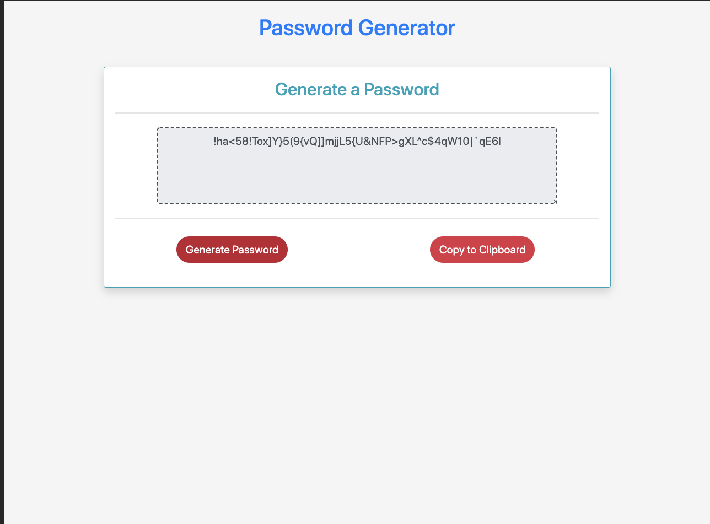
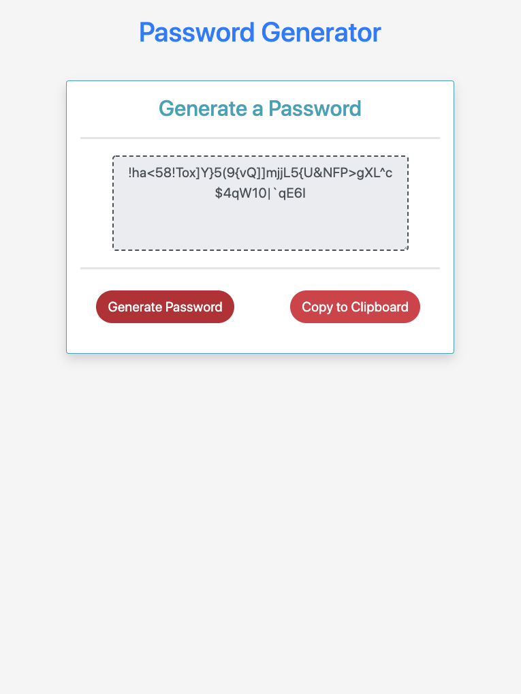
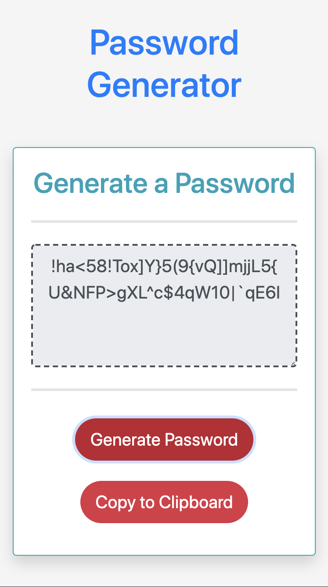

# Michaels-password-generator

DU Bootcamp HW-03 JavaScript: Password Generator

## Goal :

Create an application that generates a random password based on user-selected criteria.

## Motivation :

- For companies that handle large amounts of sensitive data, weak passwords can pose a real security threat. An application that can generate strong passwords quickly and effortlessly saves employees time and ensures secure access to data.

- AS an employee with access to sensitive data, strong password that meets certain criteria provides greater security.

## Screenshots :

| Medium Devices/ Laptop       | Small Devices/ Tablet        | Extra Small Devices/Phone  |
| ---------------------------- | ---------------------------- | -------------------------- |
|  |  |  |

## Tech/Frameworks Used :

#### Javascript :

- JavaScript is a cross-platform, object-oriented scripting language used to make webpages interactive.
- JavaScript(JS) is a lightweight, interpreted, or just-in-time compiled programming language with first-class functions.

#### Bootstrap :

- Bootstrap is a free and open-source CSS framework directed at responsive, mobile-first front-end web development. It contains CSS and (optionally) JavaScript-based design templates for typography, forms, buttons, navigation, and other interface components.

## Usage :

1. When User clicks 'Generate Password' button, user is asked to provide password length between 8 to 128.

2. Then user is asked to provide character types such as lowercase, uppercase, numbers or special characters that should be included while generating password.

3. Password is generated based on user provided length and character type and desplayed on the screen.

4. User have option to copy genrated password by using 'Copy To Clipboard' button.

## Features :

1. Responsive Web Design : Application provides Responsive web design so that it adapts to multiple screen sizes. Bootstrap is used to provide responsive functionality.

2. The application validates user input and ensures that at least one character type is selected.

3. User can choose password length between 8 to 128.

4. User can choose character types such as lowercase, uppercase, numbers or special characters that should be included while generating password.

5. User have option to copy generated password by using 'Copy To Clipboard' button.

## Deployed Website :
